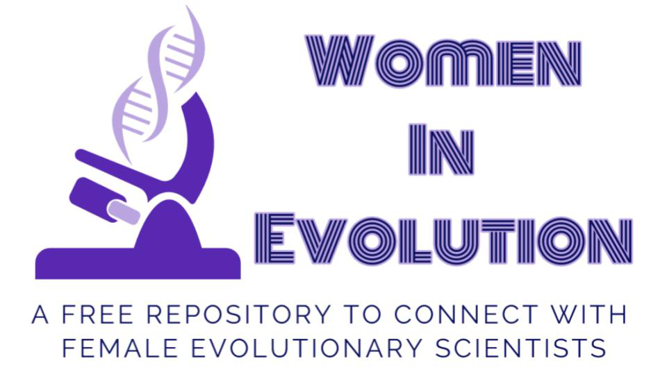

```{r out.width='100%', echo=FALSE, fig.align='center'}

```

<!-- Global site tag (gtag.js) - Google Analytics -->
<script async src="https://www.googletagmanager.com/gtag/js?id=PUTYOURIDHERE"></script>
<script>
  window.dataLayer = window.dataLayer || [];
  function gtag(){dataLayer.push(arguments);}
  gtag('js', new Date());

  gtag('config', 'PUTYOURIDHERE');
</script>

<br>

The Women in Evolution initiative aims to **increase the visibility and connectivity of women working in the field of evolution**, hopefully serving as a catalyzer towards **a more gender equal and diverse representation** of professionals in this field of knowledge. It is inspired by initiatives like [500 Women Scientist](https://500womenscientists.org/), [Women in Malaria](https://womeninmalaria.weebly.com/), [Women in Soil Science](https://franciskadevries.wordpress.com/women-in-soil-science/), [Women in Microbiology](https://microbiomedigest.com/sample-page/women-in-microbiology-for-keynote-lectures/) or [Women in Mitochondria](https:/womeninmitochondrial.org).

This database intends to create a network for collaboration and support, and to **increase women visibility** to be considered on **editorial boards, reviewers, keynote speakers or panel members**, among others.

We hope this platform serves as a space where **women working in evolution from all over the world have the opportunity to connect and be represented**.
